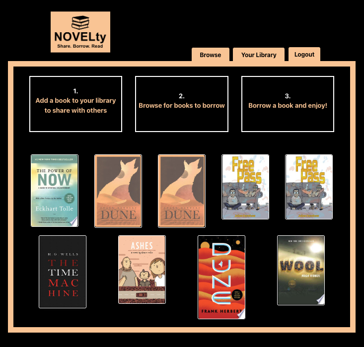

# NOVELty
<p />By Vaishali Patel, Mac Greene, Insha Sayani, Michael Martens, and Jon Shogren

[](https://opensource.org/licenses/MIT)

## Description
NOVELty book swap is a full-stack application that lets User securely signup and login to create their own digital library to share with other members. Users can search the books they have at home by ISBN and add to their personal library, ready to share. Once User has created an account and added some books, they are able to see other members' books on the Browse page. Features include requesting to borrow a book, deleting books from your library, User managed check-out of their personal library, and of course tracking of your owned and borrowed books from your NOVELty library!

## Table of Contents
1. [Description](#description)
2. [Table of Contents](#table-of-contents)
3. [Usage](#usage)
4. [Installation](#installation)
5. [License](#license)
6. [Technologies Employed](#technologies-employed)
7. [Future Development](#future-development)
8. [Contributing](#contributing)
9. [Tests](#tests)
10. [Questions](#questions)

## Usage
### User Story

```md
AS A book lover
I WANT an online personal library of all my books
SO THAT I can book swap with my peers and not lose track
```
### Acceptance Criteria 

```md
GIVEN a full-stack application deployed to Heroku that accepts user input 
WHEN I sign up for the website
THEN a User Profile is created with my credentials
WHEN I log in with my credentials
THEN I am given access to browse all available books that are not mine
WHEN I click on a book
THEN information about its Cover, Title, Description, Authors, Category, Owner and Availability are displayed
WHEN I choose to borrow the book
THEN an email to the Owner with intent to borrow is drafted and can be sent by User
WHEN I enter the Library tab
THEN I can search and add books from my personal library to digital using the ISBN number
WHEN I delete a book from my library
THEN the book is deleted from my books and the database (db)
WHEN I check-out a book to another User
THEN that book shows up in the Borrower's 'Books I Borrow' tab of their Library, plus availability and borrower information is stored in the db
WHEN I check the book back into my Library 
THEN the book is removed from Borrower's Library, the status is set to available, and borrower information is reset in the database
WHEN I click the logout tab
THEN session is ended and User can access the application by logging in again
```
## Installation
To run this locally:

1. Pull down and branch this repository
2. Run ```npm i``` to install all dependencies
3. Seed the database by running ```node seeds/seed.js```
4. Run the app with ```node server.js``` or ```npm run start```

To use this app in production, visit: https://novelty-book-swap.herokuapp.com/

The following shows the full-stack application's appearance and functionality:

<br>

## License 
This project is licensed under the MIT license.

A short and simple permissive license with conditions only requiring preservation of copyright and license notices. Licensed works, modifications, and larger works may be distributed under different terms and without source code.<p />For more information visit [MIT Licensing](https://choosealicense.com/licenses/mit/).


## Technologies Employed:<br>

<strong>Model</strong>
* MySQL
* Sequelize
* Bcrypt
* Dotenv
* Google API

<strong>View</strong>
* CSS (standard & Bulma)
* HTML
* JS
* Node.js
* Handlebars.js

<strong>Controller</strong>
* Express.js
* Axios

## Future Development
We would like to continue to add the following functionality to our application:
* Search for books by name, title, etc.
* Use SendGrid to email borrower request
* Forgot password
* Update your profile
* In-app messaging
* Rate Users (lender/borrower)
* Damage tracking/reporting (photo trail)
* Accountability on due dates of return
* Explore tab with new books to User
* Explore tab with recommendations based off User history

## Contributing
We'd love for you to contribute! In order to do so, visit [NOVELty Book Swap](https://github.com/VaishaliQA/Novelty_Project) and fork the repository. We currently require two (2) approvals by our QA team in order to merge to ```main```. <br/><br/> Please take a look at our [Future Development](#future-development) section to see what features we are looking to expand on.

## Tests
None

## Questions
Find us on Github via the individual links below:
* [Vaishali Patel](https://github.com/VaishaliQA)<br>
* [Mac Greene](https://github.com/macgreene14)<br>
* [Insha Sayani](https://github.com/isayani)<br>
* [Michael Martens](https://github.com/makeithappenmike)<br>
* [Jon Shogren](https://github.com/shogren)

Or visit our app's repository on GitHub:
[NOVELty Book Swap](https://github.com/VaishaliQA/Novelty_Project)

---
© 2022 NOVELty Book Swap (Vaishali Patel, Mac Greene, Insha Sayani, Michael Martens, Jon Shogren), Confidential and Proprietary. All Rights Reserved.
